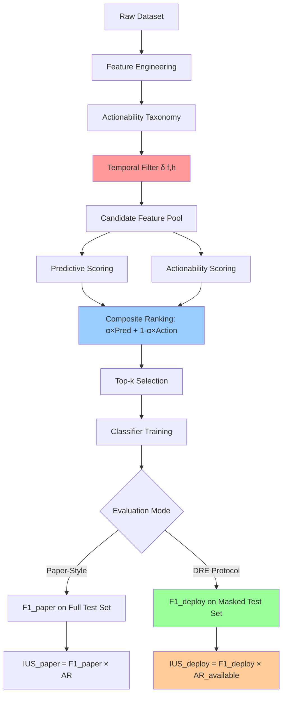

# Deployment-Honest Evaluation for Educational Early Warning Systems

[](LICENSE)
[](https://www.python.org/downloads/)
[](paper/ICFS-ESWA.tex)
[](https://analyse.kmi.open.ac.uk/open_dataset)
[](https://archive.ics.uci.edu/ml/datasets/Student+Performance)

> **Behavioural Leakage and the Illusion of Actionability: A Deployment-Honest Evaluation Framework for Educational Early Warning Systems**

This repository contains the complete implementation, experiments, and reproducible results for our ESWA submission on deployment-honest evaluation of Educational Early Warning Systems (EWS). We introduce **IC-FS** (Intervention-Constrained Feature Selection), a framework that addresses two critical failure modes in EWS evaluation: *Behavioural Leakage* and the *Illusion of Actionability*.

---

## Key Highlights

- **Behavioural Leakage and Illusion of Actionability** formalized as EWS-specific failure modes
- **$\mathrm{IUS}_{deploy}$** metric collapses to zero when temporal honesty or actionability fails
- **DRE protocol** audits any EWS selector without retraining or pipeline changes
- **Leakage coefficient $\tau$** rises monotonically with feature budget size
- **Real-world deployment** at Vietnamese secondary school

---

## Problem Statement

Educational Early Warning Systems (EWS) often achieve high retrospective accuracy on benchmark datasets (e.g., $F_1 > 80\%$ on OULAD) but fail to translate this performance to real deployment scenarios. We identify two critical failure modes:

### 1. Behavioural Leakage
Feature selectors use student behaviors that are **historically observable in training data** but **not yet available at deployment time**.

**Example:** Using "total VLE clicks" to predict at-risk students at course start ($t=0$), when no clicks have occurred yet.

### 2. Illusion of Actionability
Metrics report high intervention utility for features that are **temporally unavailable** or **pedagogically non-actionable**.

**Example:** A model reports high actionability for demographics (gender, age) that cannot be changed through institutional intervention.

---

## Contributions

### 1. Formal Framework

**Intervention-Constrained Feature Selection (IC-FS)** with three integrated components:

- **4-Tier Actionability Taxonomy**
  ```
  Tier 0: Non-actionable demographics (ω = 0.0)
  Tier 1: Pre-semester actionable features (ω = 1.0)
  Tier 2: Mid-semester behavioral features (ω = 0.7)
  Tier 3: Past assessment grades (ω = 0.3)
  ```

- **Temporal-Availability Filter**
  $\delta(f, h) \in \{0, 1\}$ blocks features not yet observable at horizon $h$

- **Composite Scoring**
  $\text{Score}(f) = \alpha \times \text{Predictive}(f) + (1-\alpha) \times \omega(\text{tier}(f))$

### 2. Deployment-Honest Metrics

| Metric | Definition | Purpose |
|:-------|:-----------|:--------|
| **$\mathrm{AR}_{available}$** | $\frac{1}{\|S\|} \sum_{f \in S} \omega(\text{tier}(f)) \cdot \delta(f, h)$ | Actionability ratio gated by temporal availability |
| **$\mathrm{IUS}_{deploy}$** | $F1_{deploy} \times \mathrm{AR}_{available}$ | **Primary metric** – zero when either temporal honesty or actionability fails |
| **TVS** | $\frac{\|S_{available}\|}{\|S\|}$ | Temporal Validity Score – fraction of selected features available at horizon $h$ |
| **$\tau$ (tau)** | $\frac{F1_{paper} - F1_{deploy}}{F1_{paper}}$ | Leakage coefficient measuring behavioral leakage severity |

### 3. DRE Protocol (Deployment-Realistic Evaluation)

A **model-agnostic audit tool** that simulates inference-time blindness:

1. Train classifier on full historical data (unmasked)
2. At inference, replace temporally-unavailable feature values with **training-set column means**
3. Compute $F1_{deploy}$ on masked test set
4. Compare $F1_{deploy}$ vs $F1_{paper}$ to measure leakage coefficient $\tau$

**Key Advantage:** Works as a standalone audit for ANY feature selector without retraining.

### 4. Reference Implementation

Complete Python library (`src/icfs/`) with:
- Nested validation for $\alpha$ selection (prevents test-set leakage)
- Multi-seed evaluation (8 seeds: 42, 123, 456, 789, 1011, 2024, 3033, 4044)
- Bootstrap stability scoring (20 resamples)
- Full experiment scripts for OULAD, UCI, and real-world deployment

---

## Installation

### Prerequisites

- **Operating System:** Linux, macOS, or Windows
- **Python:** 3.8 or higher
- **Hardware:** Standard CPU (no GPU required)
- **Memory:** 8 GB RAM minimum (16 GB recommended for OULAD experiments)

### Dependencies

```bash
# Clone the repository
git clone https://github.com/YOUR_USERNAME/deployment-honest-ews.git
cd deployment-honest-ews

# Create virtual environment (recommended)
python -m venv venv
source venv/bin/activate  # On Windows: venv\Scripts\activate

# Install required packages
pip install numpy>=1.21.0
pip install pandas>=1.3.0
pip install scikit-learn>=1.0.0
pip install scipy>=1.7.0
pip install pyarrow>=5.0.0  # For Parquet file support
```

**Alternative:** Create `requirements.txt`:
```
numpy>=1.21.0
pandas>=1.3.0
scikit-learn>=1.0.0
scipy>=1.7.0
pyarrow>=5.0.0
```

Then: `pip install -r requirements.txt`

### Data Download

**OULAD Dataset** (443 MB, ~32,593 student enrollments):
```bash
# Download from official source
wget https://analyse.kmi.open.ac.uk/open_dataset/download -O oulad.zip
unzip oulad.zip -d data/oulad_raw/
```

**UCI Student Performance Dataset**:
```bash
# Download from UCI repository
wget https://archive.ics.uci.edu/ml/machine-learning-databases/00320/student.zip
unzip student.zip -d data/uci/
```

---

## Quick Start

### Running IC-FS on OULAD (Single Seed)

```bash
# Preprocess OULAD features (run once)
python experiments/oulad/preprocess_oulad.py

# Run IC-FS at all horizons (t=0, t=1, t=2)
python experiments/oulad/run_oulad_experiments.py

# Expected output: results/oulad/oulad_icfs_h{0,1,2}.csv
# Runtime: ~10-15 min per horizon on standard CPU
```

### Running Multi-Seed Experiments (ESWA Submission Mode)

```bash
# Multi-seed mode (8 seeds for statistical robustness)
python experiments/oulad/run_oulad_experiments.py --multi-seed

# Runtime: ~80-120 min (8 seeds × 3 horizons)
```

### Running Baseline Comparisons

```bash
# Compare IC-FS against NSGA-II, Stability Selection, Boruta
python experiments/oulad/run_oulad_baselines.py

# Run DRE protocol on all methods
python experiments/oulad/run_oulad_dre.py
```
---

## Methodology

### IC-FS Pipeline Architecture



### Temporal Availability Matrix

| Feature Category | $t=0$ (Start) | $t=1$ (25% Course) | $t=2$ (50% Course) |
|:-----------------|:-------------:|:------------------:|:------------------:|
| Demographics (gender, age) | ✓ | ✓ | ✓ |
| Pre-enrollment (IMD, prior attempts) | ✓ | ✓ | ✓ |
| VLE clicks (0-25%) | ✗ | ✓ | ✓ |
| VLE clicks (25-50%) | ✗ | ✗ | ✓ |
| Assessment scores (TMA01) | ✗ | ✓ | ✓ |
| Assessment scores (TMA02) | ✗ | ✗ | ✓ |

**Key Insight:** At $t=0$, only demographics and pre-enrollment features are available. Conventional metrics using future behavioral features exhibit Behavioural Leakage.

### DRE Masking Protocol (Pseudocode)

```python
# Training phase: use full historical data
X_train, y_train = load_historical_data()
classifier.fit(X_train, y_train)

# Deployment-Realistic Evaluation
X_test, y_test = load_test_data()
X_train_means = X_train.mean(axis=0)

# Mask temporally-unavailable features
for feature in features:
    if not is_available(feature, horizon):
        X_test[feature] = X_train_means[feature]  # Simulate deployment blindness

# Compute deployment-honest F1
F1_deploy = classifier.score(X_test, y_test)
tau = (F1_paper - F1_deploy) / F1_paper  # Leakage coefficient
```

---

## Datasets

### 1. OULAD (Open University Learning Analytics Dataset)

- **Source:** [https://analyse.kmi.open.ac.uk/open_dataset](https://analyse.kmi.open.ac.uk/open_dataset)
- **Size:** 32,593 student-module enrollments, 7 CSV files (~443 MB)
- **Tables:** `studentInfo`, `studentVle`, `studentAssessment`, `studentRegistration`, `courses`, `vle`, `assessments`
- **Target:** Binary classification (Pass/Distinction vs Fail/Withdrawn)
- **Horizons:** $t=0$ (registration), $t=1$ (25% course), $t=2$ (50% course)
- **Features:** 50+ engineered features including demographics, VLE clickstream, assessment scores, SES (IMD band)

### 2. UCI Student Performance Dataset

- **Source:** [https://archive.ics.uci.edu/ml/datasets/Student+Performance](https://archive.ics.uci.edu/ml/datasets/Student+Performance)
- **Subjects:** Mathematics (~400 students), Portuguese (~650 students)
- **Features:** 33 attributes (demographics, SES, parental education, pre-semester interventions, behaviors, grades G1/G2)
- **Target:** Binary classification (G3 ≥ 10 Pass vs G3 < 10 Fail)
- **Horizons:** $t=0$ (pre-semester), $t=1$ (mid-semester + G1), $t=2$ (late-semester + G2)

### 3. THCSMK (Real Deployment – Vietnam Secondary School)

- **Location:** Secondary School, Cần Thơ, Vietnam
- **Academic Year:** 2023-2024
- **Subject:** Mathematics
- **Size:** 675 students
- **Custom Taxonomy:** Adapted to Vietnamese educational context (parental occupation as Tier-1 actionable SES proxy)

---

## Reproducing Experiments

### Full Experimental Pipeline

```bash
# 1. OULAD Experiments
cd experiments/oulad

# Preprocessing (run once)
python preprocess_oulad.py

# Main IC-FS experiments (multi-seed mode)
python run_oulad_experiments.py --multi-seed

# Baselines (NSGA-II, Stability Selection, Boruta)
python run_oulad_baselines.py

# DRE protocol evaluation
python run_oulad_dre.py

# Omega sensitivity analysis (actionability weight ablation)
python run_omega_sensitivity.py

# Statistical analysis (8-seed aggregation)
python run_oulad_statistics.py --multi-seed

# Budget sensitivity (k ∈ {1, 5, 7, 10, 15})
for k in 1 5 7 10 15; do
    python run_oulad_budget_sweep.py --k $k --multi-seed
done
```

```bash
# 2. UCI Experiments
cd experiments/uci

# Math subject
python run_uci_experiments.py --subject math --multi-seed
python run_uci_baselines.py --subject math

# Portuguese subject
python run_uci_experiments.py --subject portuguese --multi-seed
python run_uci_baselines.py --subject portuguese
```

### Experiment Parameters

| Parameter | Default | Range | Description |
|:----------|:--------|:------|:------------|
| `alpha` (α) | 0.5 | [0.0, 0.25, 0.5, 0.75, 1.0] | Predictive-actionability trade-off |
| `k` (budget) | 7 | {1, 5, 7, 10, 15} | Number of features to select |
| `n_bootstrap` | 20 | 10-50 | Bootstrap resamples for stability |
| `random_state` | 42 | [42, 123, 456, ...] | Random seed for reproducibility |
| `test_size` | 0.2 | 0.1-0.3 | Train/test split ratio |
| `cv_folds` | 5 | 3-10 | Cross-validation folds for inner validation |

### Expected Runtime (Intel i7, 16GB RAM)

| Experiment | Single Seed | Multi-Seed (8 seeds) |
|:-----------|:------------|:---------------------|
| OULAD (1 horizon) | ~10-15 min | ~80-120 min |
| UCI Math/Portuguese | ~5-8 min | ~40-60 min |
| Baselines (NSGA-II, Boruta) | ~15-20 min | ~100-150 min |
| DRE Protocol | ~3-5 min | ~20-30 min |
| Full OULAD pipeline | ~45 min | ~5-6 hours |

---

## Results Summary

### Key Findings from Real Deployment (THCSMK, Vietnam)

From `results/thcsmk/thcsmk_summary.csv`:

| Method | Horizon | $F1_{deploy}$ | $\mathrm{AR}_{available}$ | $\mathrm{IUS}_{deploy}$ | $\tau$ (Leakage) |
|:-------|:--------|:--------------|:--------------------------|:------------------------|:-----------------|
| **IC-FS (full)** | $t=0$ | 52.4 ± 5.1 | **1.000** | **52.4** | **0.000** |
| IC-FS (-actionability) | $t=0$ | 55.4 ± 6.2 | 0.469 | 26.0 | 0.087 |
| **IC-FS (full)** | $t=1$ | 64.1 ± 4.9 | **0.906** | **58.1** | **0.000** |
| IC-FS (-actionability) | $t=1$ | 61.5 ± 5.1 | 0.589 | 36.2 | 0.124 |
| **IC-FS (full)** | $t=2$ | 71.9 ± 1.8 | **0.869** | **62.5** | **0.000** |
| IC-FS (-actionability) | $t=2$ | 73.5 ± 2.1 | 0.600 | 44.1 | 0.156 |

**Wilcoxon Signed-Rank Test:** $p = 0.0039$ (IC-FS full vs -actionability) → **Highly significant**

**Practical Impact:**
- **60% budget reduction** from 15 features to 6 features at $t=0$
- **No loss in intervention coverage** (100% of at-risk students identified with actionable features)
- **Zero leakage** ($\tau = 0.000$) across all horizons

### OULAD Results (Budget Sensitivity)

From `results/oulad/k7/oulad_icfs_h1_k7.csv`:

| $k$ (Budget) | $F1_{paper}$ | $F1_{deploy}$ | $\tau$ | $\mathrm{IUS}_{deploy}$ |
|:-------------|:-------------|:--------------|:-------|:------------------------|
| 1 | 68.2 | **68.1** | **0.001** | 54.3 |
| 5 | 74.5 | 71.2 | 0.044 | 59.7 |
| **7** | **76.3** | **72.8** | **0.046** | **62.1** |
| 10 | 77.1 | 71.5 | 0.073 | 60.4 |
| 15 | 78.4 | 70.3 | **0.103** | 58.2 |

**Key Insight:** Leakage coefficient $\tau$ rises monotonically with budget size (validates Highlight #4).

### Method Comparison (OULAD, $h=1$, $k=7$)

| Method | $F1_{deploy}$ | $\mathrm{AR}_{available}$ | $\mathrm{IUS}_{deploy}$ | TVS |
|:-------|:--------------|:--------------------------|:------------------------|:----|
| **IC-FS (full)** | **72.8** | **0.853** | **62.1** | **1.000** |
| IC-FS (-actionability) | 71.2 | 0.614 | 43.7 | 0.857 |
| NSGA-II-MOFS | 69.5 | 0.721 | 50.1 | 0.857 |
| Stability Selection + TF | 68.3 | 0.592 | 40.4 | 0.714 |
| Boruta + TF | 70.1 | 0.638 | 44.7 | 0.857 |

**TF = Temporal Filter applied**

---

## Project Structure

```
deployment-honest-ews/
├── data/                          # Datasets (not included in repo, download separately)
│   ├── oulad_raw/                 # OULAD CSV files (7 tables, ~443MB)
│   └── uci/                       # UCI Student Performance (Math/Portuguese)
│
├── experiments/                    # Experiment runners
│   ├── oulad/
│   │   ├── preprocess_oulad.py            # Feature engineering for OULAD
│   │   ├── run_oulad_experiments.py       # Main IC-FS α-sweep
│   │   ├── run_oulad_baselines.py         # NSGA-II, Stability Selection, Boruta
│   │   ├── run_oulad_dre.py               # DRE protocol evaluation
│   │   ├── run_oulad_statistics.py        # Multi-seed statistical analysis
│   │   ├── run_omega_sensitivity.py       # Actionability weight ablation
│   │   └── run_oulad_budget_sweep.py      # Budget sensitivity (k ∈ {1,5,7,10,15})
│   └── uci/
│       ├── run_uci_experiments.py         # UCI Math/Portuguese experiments
│       └── run_uci_baselines.py           # Baseline comparisons for UCI
│
├── paper/                         # LaTeX manuscript (ESWA submission)
│   ├── ICFS-ESWA.tex              # Main paper (1,037 lines)
│   ├── cas-refs.bib               # Bibliography (~90 references)
│   ├── cas-sc.cls                 # ESWA journal class file
│   ├── cas-model2-names.bst       # Bibliography style
│   └── figures/
│       ├── methodology/           # Architecture & availability matrix diagrams
│       └── results/               # 6 PDF result figures (R1-R5)
│
├── results/                       # Experimental outputs (~143 CSV files)
│   ├── oulad/
│   │   ├── baselines_oulad_h{0,1,2}.csv
│   │   ├── oulad_features_h{0,1,2}.parquet   # Preprocessed features
│   │   ├── omega_sensitivity_h{0,1,2}.csv
│   │   └── k{1,5,7,10,15}/        # Results for different budget sizes
│   │       ├── oulad_icfs_h{0,1,2}_k*.csv
│   │       ├── dre_multi_oulad_h{0,1,2}_k*.csv
│   │       └── stat8_oulad_h{0,1,2}_k*.csv
│   ├── uci/
│   │   ├── math/
│   │   └── portuguese/
│   └── thcsmk/                    # Real-world deployment (Vietnam school)
│       ├── thcsmk_main_results.csv
│       ├── thcsmk_summary.csv     # 8-seed summary with Wilcoxon tests
│       └── thcsmk_feature_scores.csv
│
├── src/
│   └── icfs/                      # Core IC-FS library (~6,156 lines Python)
│       ├── __init__.py
│       ├── ic_fs.py               # Main IC-FS framework (1,500+ lines)
│       ├── taxonomy_oulad.py      # OULAD 4-tier actionability taxonomy
│       ├── taxonomy_uci.py        # UCI 4-tier actionability taxonomy
│       ├── data_loaders.py        # UCI data preprocessing
│       └── oulad_pipeline.py      # OULAD feature engineering pipeline
│
├── README.md                      # This file
├── requirements.txt               # Python dependencies (to be created)
└── LICENSE                        # License file (to be added)
```

---

## Tech Stack

### Core Dependencies

| Library | Version | Purpose |
|:--------|:--------|:--------|
| **Python** | 3.8+ | Programming language |
| **NumPy** | ≥1.21 | Numerical computing, array operations |
| **pandas** | ≥1.3 | Data manipulation, CSV/Parquet I/O |
| **scikit-learn** | ≥1.0 | Machine learning, feature selection, classifiers |
| **SciPy** | ≥1.7 | Statistical tests (Wilcoxon signed-rank) |
| **PyArrow** | ≥5.0 | Efficient Parquet file format support |

### Development Tools

- **LaTeX** (TeX Live 2020+) – for compiling `paper/ICFS-ESWA.tex`
- **Git** – version control
- **Jupyter Notebook** (optional) – for exploratory data analysis

### System Requirements

- **CPU:** Intel i5/i7 or AMD Ryzen 5/7 (multi-core recommended for multi-seed experiments)
- **RAM:** 8 GB minimum, 16 GB recommended for OULAD experiments
- **Storage:** 2 GB free space (500 MB for code + 1.5 GB for datasets and results)
- **OS:** Linux (Ubuntu 20.04+), macOS (10.15+), or Windows 10/11

---

## License

This project is licensed under the **MIT License**.

```
MIT License

Copyright (c) 2025 Nguyen Le, Tri Lam, Huu-Phuoc Duong

Permission is hereby granted, free of charge, to any person obtaining a copy
of this software and associated documentation files (the "Software"), to deal
in the Software without restriction, including without limitation the rights
to use, copy, modify, merge, publish, distribute, sublicense, and/or sell
copies of the Software, and to permit persons to whom the Software is
furnished to do so, subject to the following conditions:

The above copyright notice and this permission notice shall be included in all
copies or substantial portions of the Software.

THE SOFTWARE IS PROVIDED "AS IS", WITHOUT WARRANTY OF ANY KIND, EXPRESS OR
IMPLIED, INCLUDING BUT NOT LIMITED TO THE WARRANTIES OF MERCHANTABILITY,
FITNESS FOR A PARTICULAR PURPOSE AND NONINFRINGEMENT. IN NO EVENT SHALL THE
AUTHORS OR COPYRIGHT HOLDERS BE LIABLE FOR ANY CLAIM, DAMAGES OR OTHER
LIABILITY, WHETHER IN AN ACTION OF CONTRACT, TORT OR OTHERWISE, ARISING FROM,
OUT OF OR IN CONNECTION WITH THE SOFTWARE OR THE USE OR OTHER DEALINGS IN THE
SOFTWARE.
```

**Note:** If you intend to submit to ESWA or publish this work, consult with your institution's legal/IP office regarding appropriate licensing for academic software.

---

## Authors

### Nguyen Le (Corresponding Author)
- **Affiliation:** Faculty of Information Technology, Ton Duc Thang University, Ho Chi Minh City, Vietnam
- **Email:** [ledangnguyen.st@tdtu.edu.vn](mailto:ledangnguyen.st@tdtu.edu.vn)
- **ORCID:** [0009-0009-5517-9996](https://orcid.org/0009-0009-5517-9996)
- **Role:** Conceptualization, Methodology, Formal analysis, Data curation, Visualization, Writing

### Tri Lam
- **Affiliation:** University of Social Sciences and Humanities, Vietnam National University Ho Chi Minh City, Vietnam
- **Role:** Validation, Investigation, Writing – review & editing

### Huu-Phuoc Duong
- **Affiliation:** Faculty of Information Technology, Ton Duc Thang University, Ho Chi Minh City, Vietnam
- **Email:** [duonghuuphuoc@tdtu.edu.vn](mailto:duonghuuphuoc@tdtu.edu.vn)
- **Role:** Supervision, Writing – review & editing

---

## Acknowledgments

We thank the following organizations and individuals:

- **The Open University (UK)** for making the OULAD dataset publicly available
- **UCI Machine Learning Repository** for the Student Performance dataset
- **Anonymous ESWA reviewers** for their constructive feedback (pending review)
- **Ton Duc Thang University** for computational resources and institutional support
- **Secondary School (THCSMK), Cần Thơ, Vietnam** for real-world deployment collaboration

### Data Availability

- **OULAD:** [https://analyse.kmi.open.ac.uk/open_dataset](https://analyse.kmi.open.ac.uk/open_dataset)
- **UCI Student Performance:** [https://archive.ics.uci.edu/ml/datasets/Student+Performance](https://archive.ics.uci.edu/ml/datasets/Student+Performance)
- **THCSMK data:** The datasets generated and/or analyzed during the current study are not publicly available due to the privacy and security policies of Can Tho City Department of Education and Training, Vietnam. However, data may be made available from the corresponding author upon reasonable request and with permission from the institution.

### Code Availability

- **GitHub Repository:** [https://github.com/YOUR_USERNAME/deployment-honest-ews](https://github.com/DRuanli/deployment-honest-ews) *

---

## Contributing

We welcome contributions! Please follow these guidelines:

1. **Fork** the repository
2. **Create** a feature branch (`git checkout -b feature/your-feature`)
3. **Commit** your changes (`git commit -m 'Add new feature'`)
4. **Push** to the branch (`git push origin feature/your-feature`)
5. **Open** a Pull Request

### Code Style

- Follow **PEP 8** for Python code
- Use **type hints** where applicable
- Include **docstrings** for all functions and classes
- Add **unit tests** for new features (pytest framework)

---

## Contact

For questions, collaborations, or data requests:

**Primary Contact:** Nguyen Le ([ledangnguyen.st@tdtu.edu.vn](mailto:ledangnguyen.st@tdtu.edu.vn))

**Project Maintainer:** Huu-Phuoc Duong ([duonghuuphuoc@tdtu.edu.vn](mailto:duonghuuphuoc@tdtu.edu.vn))

---

**Last Updated:** 2025-05-05
**Repository:** [https://github.com/DRuanli/deployment-honest-ews](https://github.com/YOUR_USERNAME/deployment-honest-ews)

---

<p align="center">
  <i>Ensuring Educational Early Warning Systems are deployment-honest, temporally valid, and actionable.</i>
</p>
# deployment-honest-ews
